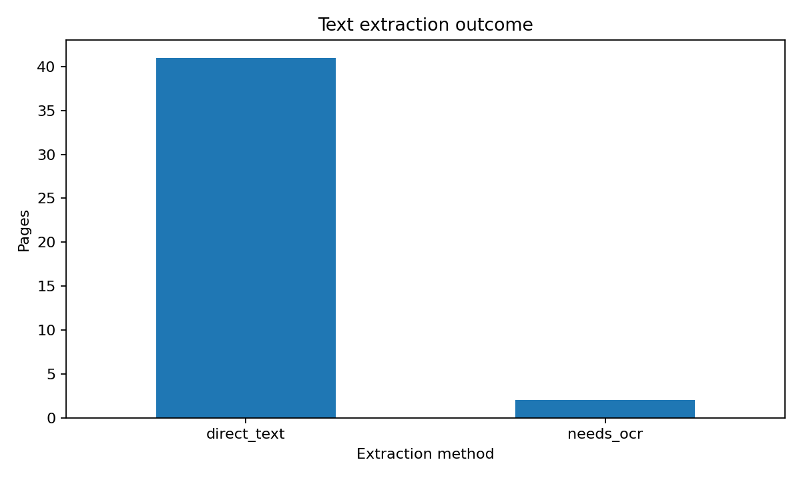
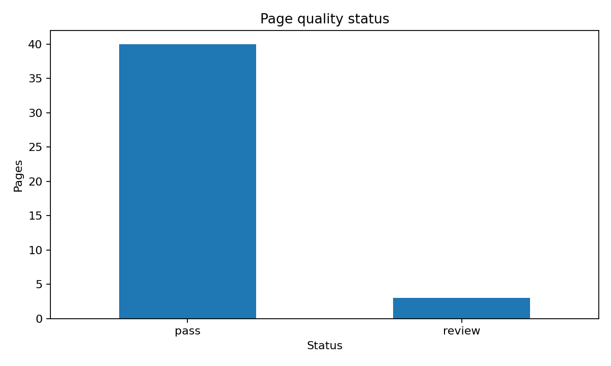
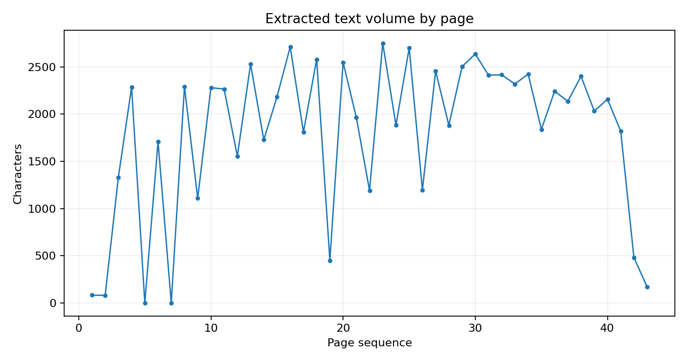

# Document Quality Analytics

## Snapshot

| Metric | Value |
| --- | ---: |
| Documents | 1 |
| Pages | 43 |
| Direct-text pages | 41 |
| Pages flagged as needing OCR | 2 |
| OCR-required rate | 4.7% |
| Pages requiring review | 3 |
| Review rate | 7.0% |
| Average characters per page | 1802.98 |
| Average words per page | 223.4 |

## Lowest-text pages

| Document | Page | Method | Characters | Status | Reason |
| --- | --- | --- | --- | --- | --- |
| ausbildungsordnungen_2023.pdf | 5 | needs_ocr | 0 | review | ocr_required |
| ausbildungsordnungen_2023.pdf | 7 | needs_ocr | 0 | review | ocr_required |
| ausbildungsordnungen_2023.pdf | 2 | direct_text | 81 | pass | quality_checks_passed |
| ausbildungsordnungen_2023.pdf | 1 | direct_text | 83 | pass | quality_checks_passed |
| ausbildungsordnungen_2023.pdf | 43 | direct_text | 170 | review | low_valid_word_ratio |

## Portfolio figures

The runnable portfolio workflow flags OCR-required pages instead of installing or running a local OCR engine.
